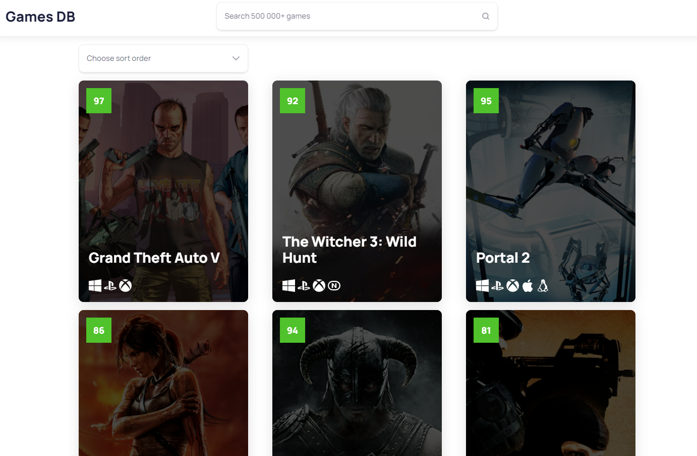
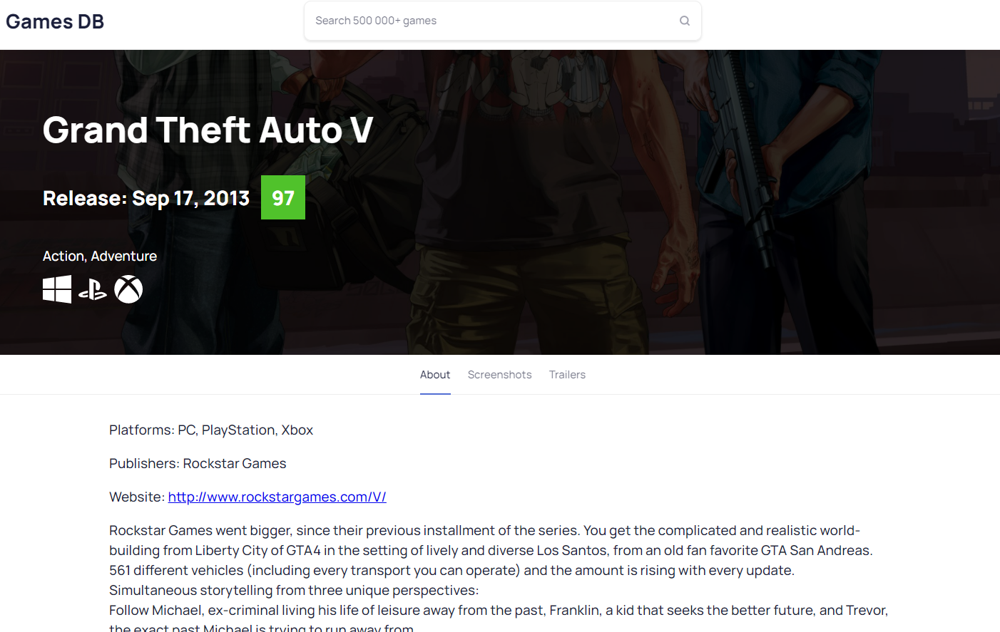

# Games DB App (v1.0)

Клиентская часть для минимальной выборки из открытого API [rawg.io](https://rawg.io/)

**Ремарка**: Функционал достаточно скуден, в рамках этого проекта уделил больше времени на "прощупывание" фреймворка

## Разработка
Стек:
- Framework: Angular v13
- UI-kit: TaigaUI
- CSS-preprocessor: SASS
- Pre-commit hooks: via Husky
- Linters pack: eslint + prettier + lint-staged

## Маршруты

- `/ | /home` - домашняя страница с выборкой данных
  - Query params:
    - `search` - параметр поиска 
    - `sort` - параметр поиска (одно из значений SORT_TYPES в core/constants)
- `/details/:id` - страница с более подробной информацией об игре

## Что далее
### В данный момент допиливается:
- [ ] unit-тесты
  - [ ] services тесты
  - [ ] components тесты
  - [ ] helpers/directive тесты
- [ ] причесываются index.ts файлы и код в целом
- [ ] делаются попытки прикрутить карусель с ng-content
- [ ] loading и error state для запросов
  
### Что планируется
- Запилить на основе этой "болванки" подобие интернет-магазина (с пользователями, корзиной, доп-фильтрами и пагинацией к API-выборке помимо сортировки и поиска)
- Для предыдущего пункта сделать нодовый мини-бэк на express/nest + postgre для раздачи информации о пользователях, состоянии аутентификации, корзине и покупках.
- Интегрировать ngrx
- Реализовать кэширование запросов (скорее всего через интерцептор)
- Попробовать в angular universal (???)

